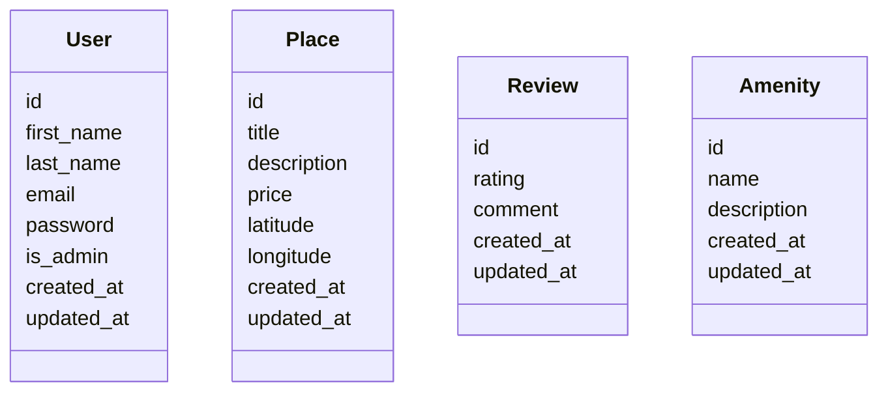
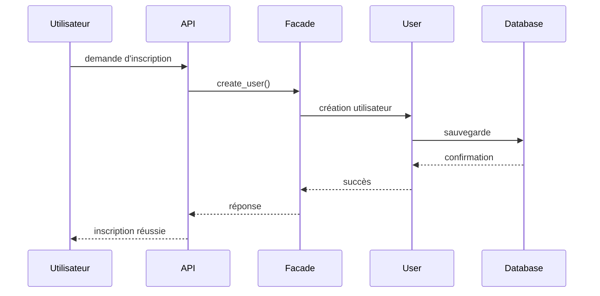

Documentation Technique – HBnB Evolution
1. Introduction
Objectif du document

Ce document présente l’architecture technique et la conception de l’application HBnB Evolution.
Son objectif est de fournir une base claire pour le développement du projet en décrivant la structure du système, les entités principales ainsi que les interactions entre les différentes couches de l’application.

Cette documentation sert de référence pour les phases d’implémentation du projet et permet de garantir une conception cohérente et bien organisée.

Présentation du projet

HBnB Evolution est une application simplifiée inspirée d’Airbnb.
Elle permet aux utilisateurs d’interagir avec une plateforme de location de logements.

Les principales fonctionnalités de l’application sont :

Création et gestion des comptes utilisateurs

Création et gestion de logements (places)

Publication d’avis (reviews) sur les logements

Association d’équipements (amenities) aux logements

L’application est construite en utilisant une architecture en trois couches :

Presentation Layer

Business Logic Layer

Persistence Layer

Cette architecture permet de séparer les responsabilités et facilite la maintenance et l’évolution du système.

2. Architecture générale

L’application HBnB suit une architecture en couches permettant de séparer les différentes responsabilités du système.

Les trois couches principales

Presentation Layer

Cette couche gère les interactions avec les utilisateurs.
Elle reçoit les requêtes via l’API et renvoie les réponses.

Business Logic Layer

Cette couche contient la logique métier de l’application.
Elle gère les entités principales et applique les règles du système.

Persistence Layer

Cette couche est responsable du stockage et de la récupération des données dans la base de données.

Utilisation du Facade Pattern

Un Facade est utilisé entre la couche de présentation et la couche de logique métier.

Le rôle de la facade est de :

simplifier les interactions entre les couches

centraliser les appels aux modèles

rendre l’API plus simple à utiliser

Diagramme d’architecture (Package Diagram)
graph TD

Utilisateur --> API

subgraph Presentation Layer
API
end

subgraph Business Logic Layer
Facade
User
Place
Review
Amenity
end

subgraph Persistence Layer
Database
end

API --> Facade
Facade --> User
Facade --> Place
Facade --> Review
Facade --> Amenity

User --> Database
Place --> Database
Review --> Database
Amenity --> Database

Ce diagramme montre comment les requêtes passent :

Utilisateur → API → Facade → Modèles → Base de données

3. Couche de logique métier

La Business Logic Layer contient les entités principales du système.

Les entités principales sont :

User

Place

Review

Amenity

Chaque entité possède un identifiant unique et des informations de suivi :

id

created_at

updated_at

Diagramme de classes

User "1" --> "*" Place : possède
User "1" --> "*" Review : écrit
Place "1" --> "*" Review : reçoit
Place "*" --> "*" Amenity : contient
Description des entités
User

Un utilisateur représente une personne utilisant la plateforme.

Attributs :

id

first_name

last_name

email

password

is_admin

created_at

updated_at

Relations :

Un utilisateur peut posséder plusieurs logements

Un utilisateur peut écrire plusieurs avis

Place

Un place représente un logement disponible sur la plateforme.

Attributs :

id

title

description

price

latitude

longitude

created_at

updated_at

Relations :

Un logement appartient à un utilisateur

Un logement peut avoir plusieurs avis

Un logement peut avoir plusieurs équipements

Review

Un review représente un avis laissé par un utilisateur.

Attributs :

id

rating

comment

created_at

updated_at

Relations :

Un avis est écrit par un utilisateur

Un avis concerne un logement

Amenity

Un amenity représente un équipement disponible dans un logement.

Attributs :

id

name

description

created_at

updated_at

Relations :

Un équipement peut être associé à plusieurs logements

4. Interaction des API

Les diagrammes de séquence permettent de montrer comment les composants du système interagissent lors d’un appel API.

4.1 Inscription d’un utilisateur

Explication :

L’utilisateur envoie une demande d’inscription via l’API.
La facade crée l’objet utilisateur et l’enregistre dans la base de données.

4.2 Création d’un logement

```mermaid
sequenceDiagram

Utilisateur->>API: créer un logement
API->>Facade: create_place()
Facade->>Place: création du logement
Place->>Database: sauvegarde
Database-->>Place: confirmation
Place-->>Facade: succès
Facade-->>API: réponse
API-->>Utilisateur: logement créé
4.3 Ajout d’un avis

sequenceDiagram

Utilisateur->>API: ajouter un avis
API->>Facade: create_review()
Facade->>Review: création de l'avis
Review->>Database: sauvegarde
Database-->>Review: confirmation
Review-->>Facade: succès
Facade-->>API: réponse
API-->>Utilisateur: avis ajouté
4.4 Récupération de la liste des logements

sequenceDiagram

Utilisateur->>API: demander les logements
API->>Facade: get_places()
Facade->>Database: requête logements
Database-->>Facade: liste des logements
Facade-->>API: résultats
API-->>Utilisateur: liste des logements
```
5. Conclusion

Cette documentation technique présente l’architecture et la conception du système HBnB Evolution.

Elle comprend :

l’architecture générale de l’application

la description des entités principales

les relations entre les objets

les interactions entre les différentes couches du système

Ce document servira de référence pour les phases de développement et permettra d’assurer une implémentation cohérente avec l’architecture définie.
