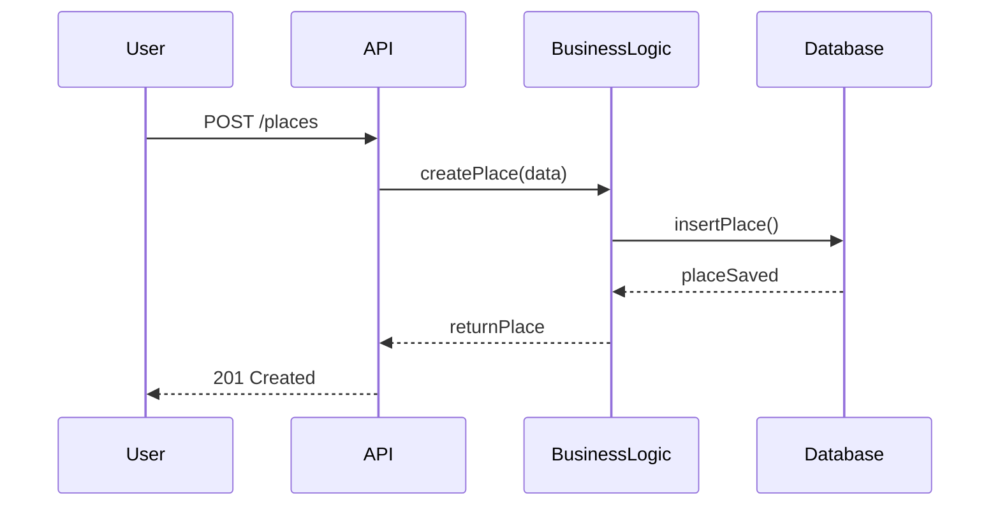

## Sequence Diagram – Place Creation

```mermaid
sequenceDiagram
participant User
participant API
participant BusinessLogic
participant Database

User->>API: POST /places
API->>BusinessLogic: createPlace(data)
BusinessLogic->>Database: insertPlace()
Database-->>BusinessLogic: placeSaved
BusinessLogic-->>API: returnPlace
API-->>User: 201 Created
```
