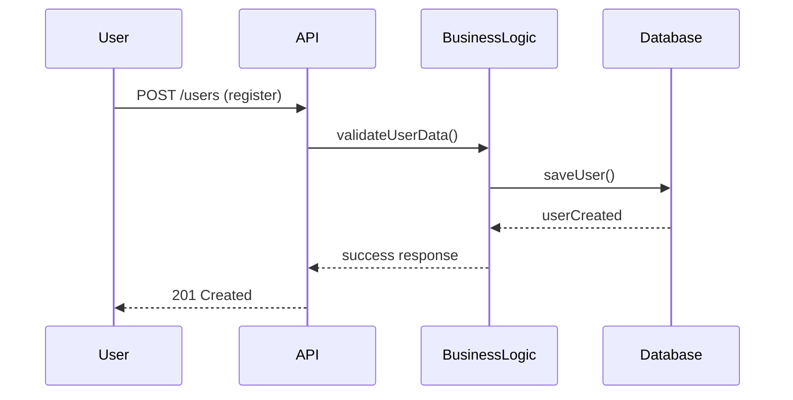

## Sequence Diagram – User Registration

```mermaid
sequenceDiagram
participant User
participant API
participant BusinessLogic
participant Database

User->>API: POST /users (register)
API->>BusinessLogic: validateUserData()
BusinessLogic->>Database: saveUser()
Database-->>BusinessLogic: userCreated
BusinessLogic-->>API: success response
API-->>User: 201 Created
```
