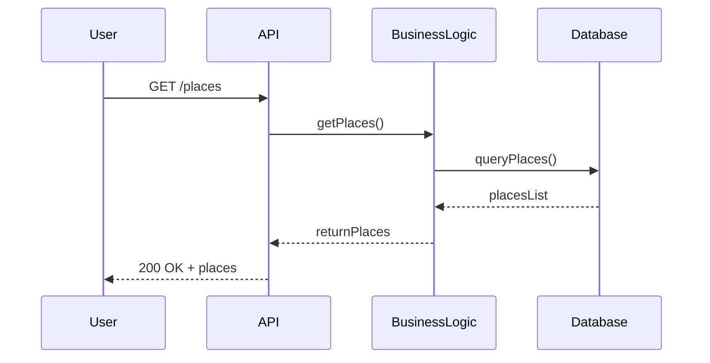

## Sequence Diagram – Fetch Places

```mermaid
sequenceDiagram
participant User
participant API
participant BusinessLogic
participant Database

User->>API: GET /places
API->>BusinessLogic: getPlaces()
BusinessLogic->>Database: queryPlaces()
Database-->>BusinessLogic: placesList
BusinessLogic-->>API: returnPlaces
API-->>User: 200 OK + places
```
